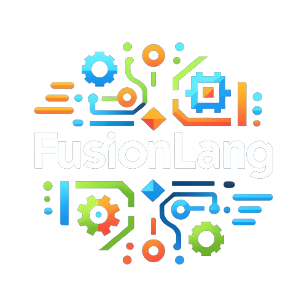

<div align="center">
  <h1>FusionLang</h1>

  
</div>
FusionLang is a new programming language designed to combine the best features of existing languages. It aims to be powerful, versatile, and easy to use, making it suitable for a wide range of applications including web development, data science, and systems programming.

## Features

- **Ease of Learning and Use**: Simple and readable syntax inspired by Python.
- **High Performance**: Compiled to native code for performance close to C++.
- **Advanced Concurrency**: Support for goroutines inspired by Go.
- **Versatility**: Suitable for web, mobile, desktop, and embedded systems development.
- **Interoperability**: Seamless integration with other popular languages like Java, Python, and C#.
- **Strong Typing and Memory Safety**: Features like type inference, garbage collection, and smart pointers.
- **Modern Features**: Null safety, extension functions, and coroutines.

## Project Structure

```yaml
FusionLang/
├── src/
│ ├── lexer.py
│ ├── parser.py
│ ├── semantic_analyzer.py
│ ├── code_generator.py
│ ├── runtime.py
│ ├── cli.py
│ ├── init.py
│ ├── ast_nodes.py
│ └── utils.py
├── tests/
│ ├── test_lexer.py
│ ├── test_parser.py
│ ├── test_semantic_analyzer.py
│ ├── test_code_generator.py
│ └── init.py
├── examples/
│ ├── hello.fusion
│ └── README.md
├── docs/
│ ├── index.md
│ ├── syntax_and_semantics.md
│ ├── type_system.md
│ ├── concurrency.md
│ ├── memory_management.md
│ ├── interoperability.md
│ └── contributing.md
├── tools/
│ ├── linter.py
│ ├── formatter.py
│ ├── init.py
├── scripts/
│ ├── build.py
│ ├── deploy.py
│ └── test.py
├── .gitignore
├── README.md
├── LICENSE
└── setup.py
```

## Getting Started

### Prerequisites

- Python 3.x

### Installation

Clone the repository:

```sh
git clone https://github.com/yourusername/FusionLang.git
cd FusionLang
```

## Running an Example
To run a FusionLang program, use the provided CLI tool. Here's how to run the hello.fusion example:
```sh
python src/cli.py examples/hello.fusion
```

## Project Components
```yaml
src/lexer.py: The lexer/tokenizer implementation.
src/parser.py: The parser implementation.
src/semantic_analyzer.py: The semantic analyzer implementation.
src/code_generator.py: The code generator implementation.
src/runtime.py: The runtime environment implementation.
src/cli.py: The command-line interface for compiling and running FusionLang programs.
src/ast_nodes.py: Definitions of AST (Abstract Syntax Tree) node classes.
src/utils.py: Utility functions and helpers.
```
## Contributing
We welcome contributions from the community. Please see the contributing guidelines for more information.

## License
This project is licensed under the MIT License - see the LICENSE file for details.

## Contact
For any questions or feedback, please open an issue on GitHub or contact us at [lotfihabbiche@gmail.com].
